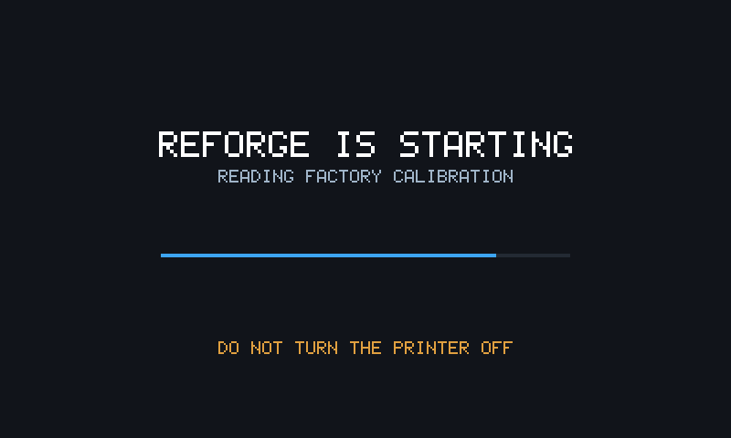
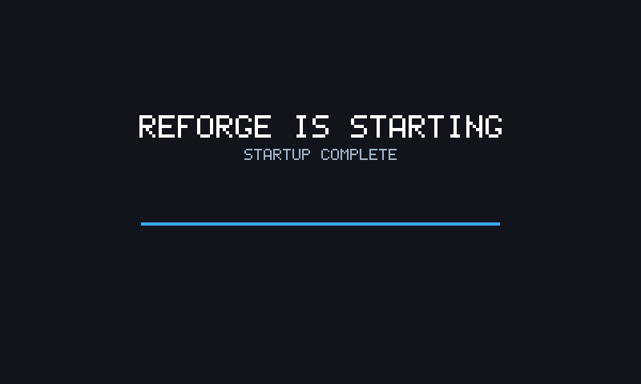

# Installing

The printer's own updater does the work: one file on a FAT32 stick, plugged
in at power-on. No jailbreak, no soldering, no opening the case, no ssh.

---

## What to have ready

Before you flash anything:

- [ ] **The stock FlashForge package for your model, downloaded and to
      hand.** It is the undo button: copy it to a stick and flash it, and the
      printer is back to how it was. That is the only recovery step needing
      nothing but a USB port — no ssh, no screen. The stock packages are
      published at [ghzserg/FF](https://github.com/ghzserg/FF/releases).
- [ ] **Your printer's model**, from Settings → About. A package for the
      other model is refused, and it is not a valid recovery image either.
- [ ] **The printer's IP address**, and a machine that can reach it.
- [ ] Time to stand at the machine. The first print after a flash is not
      something to start and walk away from.

Whatever stick you use: FAT32, with the package at the **root** of it, not
in a folder.

---

## Which file do I need

**Creator 5 and Creator 5 Pro are not interchangeable.** The printer refuses
a package built for the other model — the most common reason a flash "does
nothing" — so pick the file whose name matches your machine on the
[Releases page](https://github.com/Klipper4FlashForge/firmware/releases):

| Your printer | The file |
|---|---|
| Creator 5 | `Creator5-anvil-<date>.tgz` |
| Creator 5 Pro | `Creator5Pro-anvil-<date>.tgz` |

Not sure which you have? On the printer: **Settings → About**.

---

## The flash

1. **Format a USB stick as FAT32.** Not exFAT, not NTFS.
2. **Copy the file for your model to the root of the stick.** Not in a folder.
   Leave the name exactly as it is — the printer looks for that pattern.
3. **Power the printer off.**
4. **Plug the stick in and power the printer on.** It finds the package by
   itself and starts installing. The screen tells you to wait while it works;
   this takes a few minutes. Do not cut the power.
5. **Wait for the beep.** The printer sounds when the install has finished.
6. **Reboot manually.** Turn the power switch on the right side of the
   printer, near the power cable, off and on again.
7. **Pull the stick** once it has rebooted — your root password is on it, in
   `anvil-password.txt`.

The boot after that one is the long one, and it is the mod's rather than
FlashForge's: a progress bar on a plain screen, for a minute or two, before
HelixScreen appears. [What the first boot does](#what-the-first-boot-does)
says what is happening behind it.

---

## What the first boot does

The first boot after a flash is longer than the ones after it, and the screen
shows a progress bar rather than HelixScreen for most of it. What you'll see,
partway through and at the end:

 

Two things happen that happen only once:

* **Your machine's factory calibration comes across.** The dock and nozzle
  positions measured for your printer at the factory are copied into Klipper's
  own configuration, so it starts from its own numbers rather than from
  nothing. You do not have to do anything for this.
* **A root password is chosen**, and written to the stick. See below.

Do not cut the power during the first boot. While that copy is being saved is
the one moment where an interrupted boot can cost you the factory numbers.

---

## Your root password

The first install picks a random root password for your printer and writes it
to `anvil-password.txt` on the stick you flashed from. Read it, save it
somewhere safe, and delete the file from the stick.

* If the stick is not writable, no password is set at all — the install log
  says so.
* Later updates keep whatever password the printer already has, including one
  you have changed yourself. The stick gets a password exactly once.

Check that `ssh root@<printer-ip>` works before you go any further. That shell
is how you get in when the screen is dark, and it is worth confirming while
everything is still fine.

---

## What it changes on the printer

Nothing you have to configure. The package brings its own Klipper additions
and config files with it and wires them up itself, so the printer comes up
working.

**Your `printer.cfg` is never touched** — not by this flash and not by any
update. It is your file, it is where your own settings go, and leaving it
alone is also part of why [flashing back to
stock](going-back-to-stock.md) works cleanly.

Then work through [Your first print](first-print.md), in order, with the
emergency stop within reach: it starts with the checks that say whether the
flash went well.
